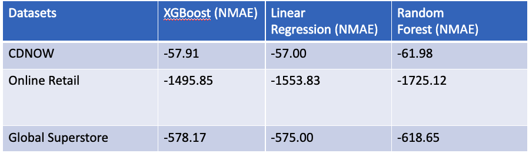

# CLV_PREDICTION

## Abstract

Customer Lifetime Value (CLV) is an important metric in relationship marketing approaches and has been increasingly considered in the field of general marketing. Organizations increasingly derive revenue from the creation and sustenance of long-term relationships with their customers. In such an environment, marketing serves the purpose of maximizing customer lifetime value customer equity, which is the sum of the lifetime values of the organization’s customers. Customer Lifetime Value is an important factor that helps in understanding customers, and it allows organizations to understand the importance of each customer. By segmenting customers into different groups, analysts can build tailored strategies for them. With various data mining approaches, critical customer knowledge can be extracted, which could further help in decision-making. This paper aims to analyze customer spending, segment customers into groups, calculate customer lifetime value and determine the best prediction model. The evaluation was carried out within customer segmentation, using the publicly available transactional database of a few companies within non-contractual e-commerce business settings. This paper also reviews several implementable CLV models that are useful for market segmentation and the allocation of marketing resources for acquisition, retention, and cross-selling. 

## INTRODUCTION 

With the rapid growth of technology and industrialization over the past decades, there has been an increasing realization that existing customers represent a valuable asset to the firm and that some customers are more valuable than others [1] and for an organization to survive, it is essential to identify, focus and retain the most valuable customers. Customer Lifetime Value (CLV) is crucial for any organization; however, most organizations have ignored it. A recent study in the United Kingdom revealed that only 34% of the marketers knew the term CLV and its connotations [2]. As a result, most small businesses and organizations fail to survive because the cost of acquiring a customer is higher than expected. CLV can help firms to make cost-effective and time-saving decisions. It will also allow companies to measure the financial impact of various activities like advertisements. 

Companies often state they are customer-centric, but a quick look under the hood often reveals spurious activities far from actual customer-centricity. Most companies use customer-based-wide averages to form their strategy and feed a generic brand message to their customers [3]. In reality, all the customers are different. Some customers bring more value to the business than others, and it is essential to identify such customers and retain them. However, retaining customers costs an organization a lot, and CLV helps an organization decide how to invest in a customer. Customer Lifetime Value is the total monetary value customers bring to an organization throughout their lifetime. 

## LITERATURE REVIEW 

Customers are viewed as a company’s most significant asset because ultimately, cash flows are supported by customer-generated revenues and also the investments made to get those revenues. Therefore, to realize continued growth, an organization must continually increase customer-generated cash flows [5]. A replacement insight into calculating CLV shows that firms should determine the profitability of every customer over the entire lifetime by calculating the present value of future cash flows. Calculating CLV (Customer Lifetime Value) can help companies to analyze the parameters that companies generally ignore. At the start of a relationship, customers are more valuable thanks to the long-run potentials that they offer [6]. Theoretically, retaining customers implies that the profits generated by them tend to accelerate over time [8]. Evidence of this can be that lifetime (or loyal) customers increase a firm’s profitability because these customers are willing to pay a premium price for products and provide corporate referrals. the corporate also gains exploit retaining existing customers instead of having to draw in new ones and increases its revenue growth through a rise in sales to its customers. Managers should allocate resources in proportion to the CLV of every customer. Thus, if customers with a negative CLV yield no investment, the corporate won't have an interest in their retention. In other words, CLV models are scientific thanks to the understanding and evaluating a firm’s relationship with its customers. Furthermore, the impact of CLV on a firm’s performance may be a factor for managers to contemplate after they want to judge the worth derived from their customers. Researchers have noted that a lot of traditional marketing metrics, like brand awareness/attitude and market share, aren't sufficient to gauge returns on marketing investment, but the assessment of CLV makes it possible to link long-term financial returns explicitly to marketing actions [8]. Second, in recent research, scholars have shown that every customer doesn't seem to be equally profitable. it's advantageous for managers to grasp CLV at the individual level to be able to allocate resources accordingly. 

## CUSTOMER LIFETIME VALUE 

Customers are central to all or any marketing activities of an organization because not only do they generate income, but they increase the company’s value. Marketing emphasizes the interconnection of all processes and activities that make, communicate, and supply values for patrons, including customer relationship management. Customer Lifetime Value is what amount a customer is predicted to spend on a selected business in their entire lifetime. It basically measures how valuable a customer is for a business. There are two most significant factors for any business growth: acquiring new customers and retaining old customers. The price of building new customer relationships is expensive compared to the price of retaining customers. So, whenever a business focuses on retaining their old customers, they increase Customer Lifetime Value (CLV); meaning the upper the CLV, the upper the loyalty of consumers towards a selected business. There are several slightly different definitions of CLV. However, a generally accepted definition of CLV is that the present value of future net cash flows related to a selected customer [9].  

The segmentation of shoppers in line with their customer lifetime value (CLV) enables companies to adequately build long-term relationships with customers and effectively manage investments into marketing tools. CLV contributes to solving several problems like decisions associated with addressing, retaining, and acquiring customers, or issues concerning a company’s long-term value. Many alternative CLV models were devised in recent decades. The high level of competition, especially in e-commerce, drives companies to spend their financial resources on marketing activities as efficiently as possible, which might be helped by implementing a CLV model that uses available historical data to estimate customer value. However, in their effort to introduce CLV as a decision-making basis for marketing management, companies operating a web store face the problem of choosing the acceptable CLV model that may be suitable for his or her reasonably business [10]. The aim of this paper is to empirically compare the predictive ability and quality of selected CLV models utilized in the net shopping environment with the help of statistical metrics.  

In addition, this paper has an aim to assist companies involved in non-contractual business setting decide concerning the choice and therefore the application of the chosen CLV model. Other recommendations concerning the implementation of a specific model also are introduced.  

This paper proposes one research question: Which of the compared models for calculating CLV encompasses a good predictive performance of CLV within the non-contractual environment of e-commerce? Good predictive performance is observed when stable quality prediction results may be achieved among all used datasets supported evaluation metrics and outperform the opposite compared models during this study. 

 
## DATASET 

Three different open-source datasets pertaining to non-contractual business setting are used and analyzed to predict the Customer Lifetime Value. The datasets used for this analysis range from years between 1998 and 2012. The following parts briefly summarizes business verticals of the datasets. 

  * CDNOW 

 	CDNOW dataset is transactional dataset that contains the purchase history up to the end of June 1998 of cohort individuals who made their first-ever purchase at CDNOW in the first quarter of 1997. The dataset contains 69659 records and four fields. The attributes and dataset information for CDNOW dataset are described in TABLE I. 

CDNOW Dataset information 

Customer_ID (object) - Customer ID is a numerical value unique to every customer. 

Transaction_Date (datetime64) - Data and time of the transaction. 

No_of_CDs_Purchased (int64 ) - The number of CDs purchased in a transaction. 

Price (float64) - The dollar value of that transaction. 

* Online Retail Store 

The online Retail Store dataset contains all the transactions occurring for a UK-based and registered, non-store online retail between 01/12/2009 and 09/12/2011. It has 1067370 records and eight fields. The attributes and dataset information for Online Retail store dataset are described in TABLE II. 

Online Retail Store Dataset information 

InvoiceNo  (object) - The Invoice number is an identifier unique to each transaction. 

StockCode (object) -  The StockCode is an identifier unique to each product. 

Description (object) - Description column contains the name of the product. 

Quantity (int64) - The number of products bought in a transaction. 

InvoiceDate (datetime64) - Data and time of the transaction. 

UnitPrice (float64) - Price of the product per unit. 

CustomerID (object) - A unique identifier assigned to each customer. 

Country (object) - Country of residence of each customer. 

* Global Superstore 

The Global Super Store dataset is a customer-centric dataset, which has all the orders placed through different vendors and markets. The attributes and dataset information for Global Superstore dataset are described in TABLE III. 

Global Superstore Dataset information 

Row ID (int64) - Unique Row ID

Order ID (object) - The unique identifier of every order. 

Order Date (datetime64) - Data and time of the order. 

Ship Date (datetime64) - Date and time of when the order was shipped. 

Ship Mode (object) - Mode of shipment 

Customer ID (object) - A unique identifier assigned to each customer. 

Customer Name (object) - Name of the customer. 

Segment (object) - 

Postal Code (float64) - Postal code of the customer. 

City (object) - City of the customer 

State (object) - State of the customer. 

Country (object) - Country of the customer. 

Region (object) - Region of the customer. 

Market (object) - Geographical region 

Product ID (object) - Product unique ID 

Category (object) - Category of product 

Sub-Category  (object) - Sub-category of product

Product Name (object) - Name of product

Sales (float64) - Total sale value 

Quantity (int64) - Quantity purchased 

Discount (float64) - Discount on transaction 

Profit (float64) - Profit from the sale 

Shipping Cost (float64) - Shipping cost incurred 

Order Priority (object) - Order priority status 

The above three datasets mentioned are analyzed here. The required data concerning the total number of customers available can be seen in TABLE IV. The datasets used for this analysis ranges from years between 1997 and 2012.   

Summary information about individual datasets 

## METHODOLOGY 

The initial phase of the research set the objectives and the actual research question further justifying the need and appropriateness of the research. In the second phase, data requirements were defined. It was then possible to determine what data and, in what form will be needed to perform the research. In the third phase, data was collected from various sources in the required format. Further, the acquired datasets that met the requirements were pre-processed for the needs of the individual predictive models. The next phase included the selection and justification of choice of CLV models suitable for use by e-commerce companies. In this stage, the implementation of the selected models was also performed according to the described models. The next phase of this research compared the selected CLV predictive models based on certain metrics. Finally, in the last phase of the research, the research question was answered. 

### Data Preprocessing 

Data preprocessing is the first step marking the initiation of the process. The datasets were incomplete, inconsistent, inaccurate, and lacked specific attribute values. This step helped to clean, format, and organize the raw data, thereby making it ready-to-go further analysis.  

Data Loading 

As mentioned earlier, we have used three datasets and loaded the from the below paths.  

CDNOW 

Online Retail Store 

Global Superstore  

Data Cleaning 

To make the data analysis ready, it is essential to deal with data inconsistencies like missing values, unnecessary columns, duplicate values, inappropriate datatype columns, etc. 

CDNOW 

After examining the CDNOW data, some discrepancies found are unnamed columns/fields and inappropriate datatype columns. All the columns were named, and the datatype of the Transaction date column has been changed from object to datetime type. 

Online Retail Store 

The Online Retail Store dataset has inappropriate datatype columns, missing and irrelevant values. In addition, all the null values were removed, and the negative values in the quantity column were also removed. 

Global Superstore 

The Global Super Store dataset has missing values and wrong datatype columns and is handled in the data cleaning process. First, all the null values were dropped, and the datatype of the Order Date field was changed to datetime type. 

Feature Selection  

Feature selection is the process by which a subset of relevant features, or variables, are selected from a larger data set for constructing models. Feature selection is made to reduce the training time and increase the predictive model's accuracy; it is crucial to select only those features or columns that contribute the most towards the prediction. So, we are mainly using Customer ID, Order Date & Revenue from all the three datasets. 

### Customer Segmentation 

Customer segmentation is the practice of categorizing customers into groups based on shared qualities so that businesses may market to each group effectively and efficiently. Marketers can better customize their marketing efforts to different audience subsets through segmentation. These activities can be related to both product development and communications [4]. For this project, customer segmentation is performed by calculating Recency, Frequency, and Monetary values. We have segmented customers into five categories as top, high-valued, medium-valued, low-valued, and lost customers. 

### Recency – Frequency – Monetary Analysis 

RFM Analysis is used to understand and analyze customer behavior based on the factors Recency, Frequency, and Monetary and help businesses segment their customers with different targeted marketing strategies. 

 * Recency  

The Recency of a customer is calculated by subtracting the last transaction date and the customer’s most recent purchase date. 

* Frequency 

Frequency is the total number of transactions made by a customer. 

* Monetary 

Monetary value is the total amount spent by a customer during all the purchases made. 

### Segmentation 

Recency – Frequency – Monetary Cluster 

Based on the calculated RFM values, Recency, Frequency, and Monetary clusters of customers are created using the K-means clustering algorithm. Further to find the optimal number of clusters Elbow curve method is used, and the optimal cluster threshold value is passed to the K-means as a parameter. Below are the Elbow curves for Recency, Frequency and Monetary values for CDNOW datasets. 

### Final Customer Segmentation 

Upon Calculating the RFM cluster, a final customer segment is created with five different categories. CDNOW RFM: Fig 4, Online Retail RFM: Fig 5, Global Superstore dataset: Fig 6 shows the RFM segmentation for CDNOW, Online Retail store, and Global Superstore dataset. 

### Customer Lifetime Value: 

Customer Lifetime Value (CLTV) is calculated to determine a business's total revenue from an individual customer. CLTV is calculated as follows: 
((Average Order Value * Purchase Frequency) / Churn) * Profit Margin  

Average Order Value: It is the ratio of the monetary value of total purchases made by the customers and the total number of orders. 

Purchase Frequency: The purchase frequency of a business is calculated as the ratio of the total number of orders placed by its customers and the total number of customers. 

Repeat Rate: Repeat rate is calculated by dividing the count of the total number of customers with more than one order by the number of unique customers. 

Churn: Churn is defined as the number of customers a business loses in a specific period. Churn is calculated as 1 – Repeat rate. 

Profit Margin: The profit margin is defined as the percentage of profit the business earns from each of its products. The CDNOW dataset and the Online Retail Store dataset did not specify the profit margin, so we have assumed that to be five percent.  
 

## CLV Calculation results 

 ### ANALYSIS 

Customer Lifetime Value is a measure of the profit streams generated by a customer across the entire life cycle. It might seem that measuring profitability associated with customers is an easy process; however, that’s not the case. We have used a bunch of methods to calculate the customer lifetime value. Basically, we tried to find out (a) How much the customers will spend in the next N days and, (b) the probability of a customer making a purchase in the next N days using regression and classification techniques respectively. 

For data modeling, we leveraged various machine learning algorithms starting from the simple regression model to ensemble techniques, which are robust as they build and combine multiple models to improve the predictive power of the model. Regression-based models identify the linear relationship between the independent and dependent variables. Whereas in ensemble technique, creates multiple models and combines them to produce better results. Within ensemble modeling, bagging is a technique in which multiple models are created by training on different data and then their predictions are combined to output the overall model prediction thus helping minimize the variance. On the other hand, boosting is a technique in which multiple models are built sequentially with the next model being trained on the data on which the prior model has performed poorly thus reducing the bias within the model. r the subject study, we mainly worked on regression, XGBoost, and Random Forest models.   

Regression models aim to identify the best fit linear line and optimal values of coefficient and intercepts so that the error is minimized. Once the relationship is identified, the model easily predicts a new set of independent variables. Regression models require relatively low computational power and allow easy interpretation of how the dependent variable is related to each of the independent variables. Regression models are widely used in finance and investment to understand the strength and type of relationship between dependent and independent variables [14]. XGBoost, which stands for extreme gradient boosting which improvises the training period of a model by parallelizing the process. It has numerous applications in natural language processing, computer vision, and speech recognition. It is currently widely used in the gaming, telecom, and IT sectors. Random Forest builds a forest consisting of decision trees that leverage the bagging technique to improve the accuracy of predicted values. The core logic is that multiple uncorrelated models perform much better as a group than individual models. Alongside, the model helps one to understand the feature importance of the independent variables. The random forest has been a go-to model in multiple industries including healthcare, e-commerce, stock market, and banking industry. 

#### Predicting customer behavior for next n days: 

Here, our aim is to leverage the historical transactional data to predict the future behavior of the customers – whether a customer is going to buy in the near future and how much the expected amount is during the time frame.  

 * Splitting the dataset by time 

Take the purchasing behavior for a set period and based on that we will analyze the last 90 days of the buying pattern. In this way we used the future information to develop targets: (a) Amount spent in next 

90 days and, (b) Spend flag (True/False). 

* Feature Engineering 

We divided the data into two proportions with one containing all the transactional data until the last 90 days and the remaining as another data subset. Within each subset of data, we calculated the average money spent by each customer, the total money spent within the data subset. Along with it, we calculated the recency and frequency during the time frame considered. 

Customers spend in next 90 days 

We used the below regression models to calculate customers spend in the next 90 days and the results are described in TABLE V: 

** XGBoost 

** Linear Regression 

** Random Forest Regressor 

NMAE for Regression models: Spend in next 90 days 

We used the below classification models to calculate the spend probability of customers in the next 90 days and the results are described in TABLE VI: 

** XGBoost  

** Logistic Regression 

** Random Forest Classifier 

Customers spend probability in next 90 days 

### CLV prediction for recent customers by considering last 6 months transactions 

We created a feature data frame by considering the expenditure of each customer during the last six months and predicted the Customer Lifetime Value using the following models and the results are described in TABLE VII: 

** XGBoost 

** Linear Regression 

** Random Forest Regressor 

NMAE for Regression models: CLV Prediction  

### Predicting future customer behavior via Probabilistic Approach: 

A probability model is a representation of the world in which observed behavior is viewed as the realization of an underlying stochastic process governed by latent (unobserved) behavioral characteristics, which in turn vary across individuals. The focus of the model-building effort is on telling a simple paramorphic story that describes (and predicts) the observed behavior instead of trying to explain differences in observed behavior as a function of covariates (as is the case with any regression model). The modeler is typically quite happy to assume that consumers’ behavior varies across the population according to some probability distribution. For the purposes of computing CLV, we wish to be able to make predictions about whether an individual will still be an active customer in the future and, if so, what his or her purchasing behavior will be. One of the first models to explicitly address these issues is the Pareto/NBD model developed by Schmittlein, Morrison, and Colombo (1987), which describes the flow of transactions in noncontractual setting. Underlying this model is the following set of assumptions [12]:  

A customer's relationship with the firm has two phases: He or she is "alive" for an unobserved period, and then becomes permanently inactive. 

* While "alive," the number of transactions made by a customer can be characterized by a Poisson process [11]. 

* Heterogeneity in the transaction rate across customers follows a gamma distribution [13]. 

* Each customer's unobserved "lifetime" is distributed exponential. 

* Heterogeneity in dropout rates across customers follows a gamma distribution [12]. 

* The transaction rates and the dropout rates vary independently across customers. 

The second and third assumptions result in the NBD, whereas the next two assumptions yield the Pareto (of the second kind) distribution. This model requires only two pieces of information about each customer’s past purchasing history: his or her “recency” (when his or her last transaction occurred) and “frequency” (how many transactions he or she made in a specified period). The notation used to represent this information is (x, tx, T), where x is the number of transactions observed in the time period (0, T] and tx(0 < tx ≤ T) is the time of the last transaction [12]. The results from Lifetimes Library are described in TABLE VIII.  

Results from Lifetimes Library: NMAE for 30 days 

### Customer Analytics Dashboard 

We fabricated a power BI dashboard that would help businesses analyze customers & provide a solution that allows making data driven decision. It is basically a customer analytics dashboard that predicts spend of the customers in the next 90 days. 

This dashboard shown in Fig 9 has all the customers and there’s an algorithm running behind the scenes that compares what they should be spending & compares it to what they have spent. This can help track those customers that were predicted to spend more than what they actually spent and target them with an email or offer to spend more money. 

## CONCLUSIONS 

The Machine Learning methods for solving the Customer Lifetime Value estimation problem will continue to evolve and gain interest from both industry and academia point of view. There are different perspectives from which this problem is often tackled, offering businesses the chance to model CLV consistent with their specific needs and use cases.  

However, the selection of the Machine Learning method for solving CLV estimation must consider the various aspects of the machine learning systems within which it's implemented. Like we have seen, the provision and dimensions of the training datasets, the specified accuracy of the predictions, and the integration of the methods with other models are all common decisions that require to be taken. End-to-end machine learning solutions are only precise after they directly match the character of the information they're built on and the nature of the business use cases that require to be improved.  

## APPLICATIONS OF CLV 

Customer Lifetime Value calculations help in understanding the potential value of customers and prompting businesses to learn more about the patterns of individuals or groups of customers. This information allows the firm to devise optimal strategies for each customer, eliminate unwanted costs, and create a long-term perspective of the potential relationship with customers. Organizations can tailor strategies to deal with different customer segments that exhibit differences in buying characteristics, and they can customize different strategies for the same customer depending on the stage of the relationship between the customer and the organization. In other words, the main benefit derived from CLV analysis is that the firm management can take advantage of the analysis of results to predict the future profitability of customers and make more appropriate marketing strategies and decisions relating to customers [16]. CLV models offer insights into managing the existing customer base. For example, classifying customers into high, medium, and low-value customers not only allows differentiation of products or services according to expected customer value but provides an objective basis to direct retention efforts toward high-value customers. In addition, knowledge of CLV can be used to develop a profile of high-value customers which can then be applied to a prospect list to make customer acquisition efforts more efficient and effective. Customer management activities at organizations involve making consistent decisions over time, about: (a) which customers to select for targeting, (b) the level of resources to be allocated to the selected customers, and (c) securing the link between business actions and customer profitability [15]. The lifetime value of the customer has a few potential applications when making marketing decisions, such as helping a firm determine how much it can afford to spend to acquire new customers. Sometimes the best customers might cost more to obtain but will generate much higher returns than will those customers that are less costly to obtain. The CLV model can be used to assist the businesses in quantifying this tradeoff and examining the consequences of a change in a customer’s buying behavior in terms of the long-term profitability of the account. 

## ACKNOWLEDGEMENTS 

We would like to express our special thanks of gratitude to our Professor Darin Johnson, for his insights and support throughout the coursework. 

## REFERENCES 

[1] Lindgreen, A. and Wynstra, F., 2005. Value in business markets: What do we know? Where are we going? Industrial Marketing Management. 

[2] Bas Drogtrop., 2020. How to optimize Customer Lifetime Value (CLV)—15 tactics every marketer needs to know. https://useinsider.com/how-to-optimize-customer-lifetime-value-clv-15-effective-tactics-that-every-marketer-needs-to-know/  

[3] Lauri Eurén., 2019. The overlooked and misunderstood: customer-centricity and customer lifetime value. https://www.columbiaroad.com/blog/the-overlooked-and-misunderstood-customer-centricity-and-customer-lifetime-value  

[4] Shopify., “Customer segmentation definition - what is Customer Segmentation” https://www.shopify.com/encyclopedia/customer-segmentation  

[5] Hansotia, Behram. (2003). Company activities for managing customer equity. The Journal of Database Marketing & Customer Strategy Management. 11. 319-332. 10.1057/palgrave.dbm.3240231. 

[6] L. Ryals, “Are your customers worth more than money?,” Journal of Retailing and Consumer Services, vol. 9, no. 5, pp. 241–251, 2002. 

[7] “3 best machine learning models to predict customer lifetime value (CLTV),” Blue Orange. [Online]. Available: https://blueorange.digital/3-best-machine-learning-models-to-predict-customer-lifetime-value-cltv/   

[8] Chang, Wen & Chang, Chen & Li, Qianpin. (2012). Customer Lifetime Value: A Review. Social Behavior and Personality: an international journal. 40. 10.2224/sbp.2012.40.7.1057. 

[9] Estrella-Ramón, Antonia & Sánchez-Pérez, Manuel & Swinnen, Gilbert & Vanhoof, Koen. (2013). A marketing view of customer value: Customer lifetime value and customer equity. SOUTH AFRICAN JOURNAL OF BUSINESS MANAGEMENT. 44. 47-64. 10.4102/sajbm.v44i4.168. 

[10] P. Jasek, L. Vrana, L. Sperkova, Z. Smutny, and M. Kobulsky, “Modeling and application of Customer Lifetime Value in online retail,” Informatics, vol. 5, no. 1, p. 2, 2018. 

[11] M. D. Mahi, “Buy till you die(btyd) model for Customer Life Time Value Calculation,” Medium, 30-Aug-2019. [Online]. Available: https://medium.com/@maheshdmahi/buy-till-you-die-btyd-model-for-customer-life-time-value-calculation-bf4cef3d080d  

[12] Justin, “Using customer lifetime value to transform Not wreck your business,” BlueVenn, 24-May-2021. [Online]. Available: https://uplandsoftware.com/bluevenn/resources/blog/using-customer-lifetime-value-to-transform-not-wreck-your-business/  

[13] S. Gupta, D. Hanssens, B. Hardie, W. Kahn, V. Kumar, N. Lin, N. Ravishanker, and S. Sriram, “Modeling customer lifetime value,” Journal of Service Research, vol. 9, no. 2, pp. 139–155, 2006. 

[14] B. Beers, “What regression measures,” Investopedia, 07-Dec-2021. [Online]. Available: https://www.investopedia.com/terms/r/regression.asp  

[15] V. Kumar, Rajkumar Venkatesan, Tim Bohling, Denise Beckmann, (2008) Practice Prize Report—The Power of CLV: Managing Customer Lifetime Value at IBM. Marketing Science 27(4):585-599. https://doi.org/10.1287/mksc.1070.0319  

[16] Guracaronu, C., & Ranchhod, A. (2002). Measuring customer satisfaction: A platform for calculating, predicting and increasing customer profitability. Journal of Targeting, Measurement & Analysis for Marketing, 10, 203-219. http://doi.org/hcd  
